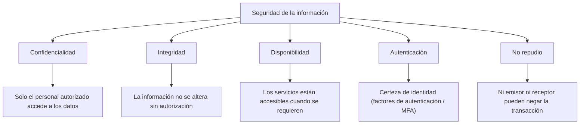

```mermaid
flowchart TB
    SI["Seguridad de la información"]
    SI --> C["Confidencialidad"]
    SI --> I["Integridad"]
    SI --> D["Disponibilidad"]
    SI --> A["Autenticación"]
    SI --> NR["No repudio"]

    C --> C1["Solo el personal autorizado accede a los datos"]
    I --> I1["La información no se altera sin autorización"]
    D --> D1["Los servicios están accesibles cuando se requieren"]
    A --> A1["Certeza de identidad (factores de autenticación / MFA)"]
    NR --> NR1["Ni emisor ni receptor pueden negar la transacción"]
```