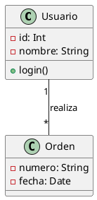

<!-- _class: lead -->

# Diagrama de Clases en UML

## UD 4.2 - Estructura Estática de Sistemas Orientados a Objetos


---

## ¿Qué es un Diagrama de Clases?

<div class="important">

**Definición**: Uno de los diagramas más importantes de UML 2.5, clasificado dentro de los **diagramas de estructura**. Representa elementos de un sistema desde un punto de vista **estático**.

</div>

### Características Principales

- **Orientado a objetos**: Define clases para la fase de construcción
- **Vista estática**: Muestra estructura, NO comportamiento dinámico
- **Modelo lógico**: Similar al diagrama Entidad-Relación (E/R)
- **Fundamental**: Es el diagrama más utilizado en UML

<div class="note">

**Punto clave**: Este diagrama NO incluye cómo se comportan los elementos durante la ejecución. Esa función la cumplen los diagramas de comportamiento (secuencia, casos de uso, etc.).

</div>

---

## ¿Qué describe el Diagrama de Clases?

### Elementos Representados

| Aspecto | Descripción |
|---------|-------------|
| **Tipos de objetos** | Las clases que existirán en el sistema |
| **Relaciones estáticas** | Cómo se conectan las clases entre sí |
| **Atributos** | Características/propiedades de cada clase |
| **Operaciones** | Métodos/funciones que pueden realizar |
| **Restricciones** | Reglas sobre cómo se conectan los objetos |

### Analogía con E/R

<div class="note">

El diagrama de clases es **similar al diagrama Entidad-Relación (E/R)** de bases de datos:
- Ambos muestran el modelo lógico de datos
- Ambos representan datos y sus interacciones
- Tienen utilidad similar en sus contextos

</div>

---

## Fases del Ciclo de Vida

### ¿Cuándo se desarrolla el diagrama?

<div class="columns">

<div>

### Análisis del Sistema

- Modelado del **dominio del problema**
- Entender requisitos del mundo real
- Base para diseñar la solución técnica

</div>

<div>

### Diseño

- Modificación para implementación
- Incluir detalles técnicos
- Adaptar a tecnologías y restricciones

</div>

</div>

---

## Elementos Principales del Diagrama

### Los Tres Pilares

```
┌─────────────────────────────────────────────────────────┐
│  1. CLASES                                              │
│     Representan objetos y conceptos del mundo real      │
│     Son los "actores" principales del sistema           │
├─────────────────────────────────────────────────────────┤
│  2. RELACIONES                                          │
│     Asociaciones y dependencias entre clases            │
│     Muestran cómo se interrelacionan e interactúan      │
├─────────────────────────────────────────────────────────┤
│  3. INTERFACES                                          │
│     Contratos que las clases pueden implementar         │
│     Definen QUÉ hacer, no CÓMO hacerlo                  │
└─────────────────────────────────────────────────────────┘
```

---

<!-- _class: lead -->

# 1. Las Clases

## El Elemento Fundamental

---

## ¿Qué representa una Clase?

<div class="important">

Una clase describe un **conjunto de objetos** con responsabilidades y características comunes dentro de un sistema.

</div>

### Ejemplos de Dominio

| Concepto | Ejemplo |
|----------|---------|
| **Tangibles** | Avión, Auto, Televisor, Computador |
| **Roles** | Gerente, Cliente, Vendedor, Profesor |
| **Organizaciones** | Universidad, Empresa, Departamento |
| **Interacciones** | Transacción, Matrícula, Contrato |
| **Eventos** | Vuelo, Accidente, Suceso |

---

## Representación Gráfica de una Clase

### Las Tres Zonas

<div class="uml-box">

┌─────────────────────────┐
│ <b>Nombre de Clase</b>  │  
├─────────────────────────┤
│    - atributo1: Tipo    │  
│    - atributo2: Tipo    │
├─────────────────────────┤
│    + metodo1(): Tipo    │  
│    + metodo2(): Tipo    │
└─────────────────────────┘

</div>

---

### Equivalencia en Java

```java
public class NombreDeClase {
    // Atributos (Zona 2)
    private Tipo atributo1;
    private Tipo atributo2;

    // Métodos (Zona 3)
    public TipoDevuelto metodo1(Parametros parametros) { }
    public TipoDevuelto metodo2(Parametros parametros) { }
}
```

---

## Zona 1: Nombre de la Clase

### Reglas de Nomenclatura

<div class="columns">

<div>

### ✅ Correcto
- `Usuario`
- `CarritoCompras`
- `OrdenDePago`
- `Libro`
- `Cliente`

</div>

<div>

### ❌ Incorrecto
- `usuario` (minúscula)
- `CarritoCompra` (inconsistencia)
- `user` (inglés mezclado)
- `Libros` (plural)
- `CrearLibro` (verbo)

</div>

</div>

<div class="tip">

**Convención PascalCase**: Primera letra mayúscula de cada palabra. Ayuda a diferenciar visualmente las clases.

**Clases abstractas**: Se escriben en *cursiva* para indicar que no pueden instanciarse directamente.

</div>

---

## Zona 2: Atributos

### Formato Completo

```
visibilidad nombre_atributo : tipo = valor-inicial { propiedades }
```

### Ejemplos Prácticos

| Notación UML | Significado |
|--------------|-------------|
| `- nombre : String` | Privado, tipo String |
| `- edad : Int = 0` | Privado, Int, inicializa en 0 |
| `- activo : Boolean` | Privado, Boolean |
| `# coordenadas : List<Double>` | Protegido, lista de Double |
| `+ ID : Int {unique}` | Público, Int, debe ser único |

---

### Tipos de Atributos

<div class="columns">

<div>

**De Instancia**
```java
private String nombre = "";
private int numeroPuertas = 4;
```
Valores propios de cada objeto

</div>

<div>

**De Clase (Estáticos)**
```java
private static double promedioEdades = 0.0;
private static int numeroAlumnos = 0;
```
Compartidos por todas las instancias

</div>

</div>

---

## Zona 3: Métodos

### Formato Completo

```
visibilidad nombre_funcion(parametros) : tipo-devuelto { propiedades }
```

### Ejemplos Prácticos

| Notación UML | Descripción |
|--------------|-------------|
| `+ getNombre() : String` | Público, sin parámetros, retorna String |
| `+ setEdad(edad: int) : void` | Público, recibe Int, no retorna nada |
| `+ calcularDescuento(precio: Double, porcentaje: Double) : Double` | Público, dos parámetros Double, retorna Double |
| `# validarEmail(email: String) : Boolean` | Protegido, recibe String, retorna Boolean |

---

### Convenciones de Nomenclatura

<div class="tip">

- **Getters**: `getNombreAtributo()` - obtener valores
- **Setters**: `setNombreAtributo(valor)` - establecer valores
- **Validación**: `validar...()`, `es...()`, `tiene...()`
- **Acciones**: `crear...()`, `actualizar...()`, `eliminar...()`

</div>

---

## Visibilidad en UML

### Símbolos y Significados

| Símbolo | Visibilidad | Acceso |
|---------|-------------|--------|
| `+` | **Pública** | Desde cualquier lugar |
| `-` | **Privada** | Solo desde la misma clase |
| `#` | **Protegida** | Clase y clases derivadas (herencia) |
| `~` | **Paquete** | Clases del mismo paquete |
| `/` | **Derivado** | Calculado a partir de otros atributos |

<div class="note">

Los tres más comunes: `+` (público), `-` (privado), `#` (protegido)

</div>

---

## Miembros Estáticos

### Representación

Los atributos o métodos estáticos se representan **<u>subrayando</u>** su nombre.

<div class="important">

**Definición**: Una característica estática **pertenece a la clase** y **NO se instancia para cada objeto**. Todos los objetos acceden al mismo miembro.

</div>

---

### Ejemplo: Clase Coche

```java
public class Coche {
    private String marca;
    private String modelo;

    // Atributos estáticos - compartidos por toda la clase
    private static String posicionVolante = "Izquierda";
    private static String unidadDistancia = "Kilómetros";

    public Coche(String marca, String modelo) {
        this.marca = marca;
        this.modelo = modelo;
    }

    public String mostrarConfiguracion() {
        return "Coche: " + marca + " " + modelo + ", Volante: " + posicionVolante;
    }

    // Método estático
    public static void configurarPorPais(String pais) { 
        // implementación
    }
}
```

---

## Ejemplo Completo: Clase Libro

### Diagrama UML

<div class="uml-box">

┌─────────────────────────┐
│          Libro          │
├─────────────────────────┤
│ - cantidadLibros: Int   │ 
│ - autor: String         │
│ - titulo: String        │
├─────────────────────────┤
│ + Libro()               │
│ + Libro(autor, titulo)  │
│ + setAutor(autor)       │
│ + getAutor()            │
│ + setTitulo(titulo)     │
│ + getTitulo()           │
│ + getNumeroEjemplares() │ 
│ + toString()            │
└─────────────────────────┘

</div>

---

### Implementación en Java

```java
public class Libro {
    private String autor;
    private String titulo;
    private static int cantidadLibros = 0;

    public static int getNumeroEjemplares() {
        return cantidadLibros;
    }

    public Libro() {
        this("NA", "NT");
    }

    public Libro(String autor, String titulo) {
        this.autor = autor;
        this.titulo = titulo;
        cantidadLibros++;
    }

    public void setAutor(String autor) { 
        this.autor = autor; 
    }

    public String getAutor() { 
        return autor; 
    }

    public void setTitulo(String titulo) { 
        this.titulo = titulo; 
    }

    public String getTitulo() { 
        return titulo; 
    }

    @Override
    public String toString() { 
        return "Datos de libro: " + titulo + "\n" + autor; 
    }
}
```

---

<!-- _class: lead -->

# 2. Interfaces

## Contratos de Comportamiento

---

## ¿Qué es una Interfaz?

<div class="important">

**Definición**: Una interfaz define un **contrato** que las clases pueden implementar. Especifica **QUÉ** debe hacer una clase, sin decir **CÓMO** hacerlo.

</div>

### ¿Por qué son importantes?

1. **Polimorfismo**: Tratar objetos diferentes de forma uniforme
2. **Desacoplamiento**: Reducir dependencias entre componentes
3. **Extensibilidad**: Agregar funcionalidades sin modificar código existente
4. **Contratos claros**: Documentan comportamiento esperado

### Analogía del Mundo Real

<div class="note">

Un **enchufe eléctrico** es una interfaz. Especifica: "cualquier dispositivo debe tener 2 pines, voltaje X". No importa si es lámpara, TV o computadora - solo especifica el contrato que deben cumplir.

</div>

---

## Representación de Interfaces en UML

### Notación

<div class="uml-box">

┌─────────────────────────┐
│    <<interface>>        │ 
│    IVolador             │
├─────────────────────────┤
│ + volar() : Unit        │ 
│ + aterrizar() : void    │
│ + getAltitud() : Double │
└─────────────────────────┘

</div>

### Diferencias con Clases

| Característica | Interfaz | Clase |
|--------------|----------|-------|
| Estereotipo | `<<interface>>` | Ninguno |
| Atributos | No tiene (solo métodos) | Sí tiene |
| Implementación | Solo firma de métodos | Código completo |

---

## Ejemplo Práctico: Sistema de Pagos

### Interfaz IProcesadorPago

```java
public interface IProcesadorPago {
    boolean procesarPago(double monto);
    boolean reembolsar(double monto);
    boolean verificarFondos(double monto);
}
```

---

### Implementaciones Concretas

```java
// Implementación para Tarjeta de Crédito
public class ProcesadorTarjeta implements IProcesadorPago {
    private String numeroTarjeta;

    @Override
    public boolean procesarPago(double monto) {
        System.out.println("Procesando pago de $" + monto + " con tarjeta " + numeroTarjeta);
        return true;
    }

    @Override
    public boolean reembolsar(double monto) {
        return true;
    }

    @Override
    public boolean verificarFondos(double monto) {
        return true;
    }
}

---

// Implementación para PayPal
public class ProcesadorPayPal implements IProcesadorPago {
    private String email;

    @Override
    public boolean procesarPago(double monto) {
        System.out.println("Procesando pago de $" + monto + " con PayPal (" + email + ")");
        return true;
    }

    @Override
    public boolean reembolsar(double monto) {
        return true;
    }

    @Override
    public boolean verificarFondos(double monto) {
        return true;
    }
}
```

---

## Interfaces vs Clases Abstractas

### Tabla Comparativa

| Característica | Interfaz | Clase Abstracta |
|----------------|----------|-----------------|
| **Implementación** | Solo firma de métodos | Puede tener métodos implementados |
| **Atributos** | No puede tener | Sí puede tener |
| **Herencia múltiple** | ✅ Sí (una clase puede implementar varias) | ❌ No (solo heredar de una) |
| **Propósito** | Definir contrato de comportamiento | Proporcionar implementación base |
| **Uso** | "Puede hacer" | "Es un tipo de" |

---

### Ejemplo Combinado

```java
// Interfaz: Define QUÉ debe hacer
public interface IVolador {
    void volar();
}

// Clase abstracta: Define QUÉ y CÓMO (parcialmente)
public abstract class Animal {
    protected String nombre;

    public abstract void hacerSonido();

    public void dormir() {
        System.out.println(nombre + " está durmiendo");
    }
}

// Una clase puede heredar de una abstracta e implementar interfaces
public class Pajaro extends Animal implements IVolador {
    @Override
    public void hacerSonido() {
        System.out.println(nombre + " hace: pío pío");
    }

    @Override
    public void volar() {
        System.out.println(nombre + " está volando");
    }
}
```

---

<!-- _class: lead -->

# 3. Relaciones entre Clases

## Cómo se Conectan los Elementos

---

## Propiedades de las Relaciones

### 1. Multiplicidad (Cardinalidad)

Indica el **número de elementos** que participan en una relación.

| Notación | Significado | Ejemplo |
|----------|-------------|---------|
| `1` | Exactamente uno | Cada persona tiene un DNI |
| `0..1` | Cero o uno | Cliente puede tener 0 o 1 descuento |
| `*` o `0..*` | Cero o muchos | Usuario puede tener 0 o más órdenes |
| `1..*` | Uno o muchos | Equipo tiene al menos 1 miembro |
| `n` | Exactamente n | Un dado tiene 6 caras |
| `m..n` | Desde m hasta n | Auto tiene entre 2 y 10 ruedas |

---

### Ejemplo: Curso y Clase

```
Curso "1" ─────── "1..*" Clase
```

- Un `Curso` tiene una o más `Clases`
- Cada `Clase` pertenece a exactamente un `Curso`

---

## Propiedades de las Relaciones (cont.)

### 2. Nombre de la Asociación

Describe el **significado** de la relación usando verbos.

**Ejemplos**:
- "Una empresa **contrata** a n empleados"
- "Un profesor **imparte** m clases"
- "Un cliente **realiza** múltiples pedidos"

### 3. Rol

Indica el **papel** que juega cada clase en la relación.

```
┌─────────┐   Se imparte   ┌─────────┐
│  Curso  │1 ───────────→ *│  Clase  │
└─────────┘+curso   +clases└─────────┘
```

- Rol de `Curso`: `+curso` (cada Clase pertenece a un Curso)
- Rol de `Clase`: `+clases` (un Curso imparte múltiples Clases)

---

## Tipos de Relaciones: Resumen Visual

```
DEPENDENCIA (Muy débil)     ASOCIACIÓN (Débil)
A - - - - - - - - - - → B   A ───────────────── B
     usa                         tiene

AGREGACIÓN (Media)          COMPOSICIÓN (Fuerte)
A ◇────────────────── B     A ♦──────────────── B
     tiene un                       es parte de
     (independiente)                (dependiente)

HERENCIA (Muy fuerte)       IMPLEMENTACIÓN (Muy fuerte)
     △                           △
     │ ┐                         │ ┐
A ───┘ │ (es un)            A - ┘ │ (implementa)
```

---

## Tabla Resumen de Relaciones

| Relación | Símbolo | Fuerza | Descripción | Ejemplo |
|----------|---------|--------|-------------|---------|
| **Dependencia** | `- - →` | ⭐ Muy débil | Uso temporal | Calculadora usa Math |
| **Asociación** | `───` | ⭐⭐ Débil | Relación general | Persona tiene Mascota |
| **Agregación** | `◇───` | ⭐⭐⭐ Media | "Tiene un" (independiente) | Mesa tiene Tornillo |
| **Composición** | `♦───` | ⭐⭐⭐⭐ Fuerte | "Es parte de" (dependiente) | Coche tiene Motor |
| **Herencia** | `───▷` | ⭐⭐⭐⭐⭐ Muy fuerte | "Es un" | Perro es Animal |
| **Implementación** | `- - ▷` | ⭐⭐⭐⭐⭐ Muy fuerte | Implementa interfaz | Avion implementa IVolador |

---

## 1. Asociación

### Definición

<div class="important">

Representa una **dependencia semántica** donde dos o más clases están conectadas mediante una relación lógica del dominio. Es el tipo de relación más común y general.

</div>

### Representación

- **Línea continua simple** que une las clases
- Opcionalmente con **flecha** que indica dirección de navegación

### Ejemplo 1: Empresa-Empleado (Binaria)

```
┌──────────┐  Contrata  ┌──────────┐
│ Empresa  │1 ──────── n│ Empleado │
└──────────┘            └──────────┘
```

---

**En Java**:
```java
import java.util.ArrayList;
import java.util.List;

public class Empresa {
    private String nombre;
    private List<Empleado> empleados = new ArrayList<>();

    public Empresa(String nombre) {
        this.nombre = nombre;
    }

    public void contratarEmpleado(Empleado empleado) {
        empleados.add(empleado);
        empleado.setEmpresa(this);
    }

    public List<Empleado> getEmpleados() {
        return empleados;
    }
}

public class Empleado {
    private String nombre;
    private Empresa empresa;

    public Empleado(String nombre) {
        this.nombre = nombre;
    }

    public void setEmpresa(Empresa empresa) {
        this.empresa = empresa;
    }
}
```

---

## Asociación (cont.)

### Ejemplo 2: Persona-Mascota

```
┌──────────┐  tiene  ┌──────────┐
│ Persona  │1 ────── *│ Mascota  │
└──────────┘         └──────────┘
  -persona               +mascotas
```

**En Java (bidireccional)**:
```java
import java.util.ArrayList;
import java.util.List;

public class Persona {
    private String nombre;
    private List<Mascota> mascotas = new ArrayList<>();

    public Persona(String nombre) {
        this.nombre = nombre;
    }

    public void agregarMascota(Mascota mascota) {
        mascotas.add(mascota);
        mascota.setDueno(this);
    }
}

```

---


```java

public class Mascota {
    private String nombre;
    private Persona dueno;

    public Mascota(String nombre) {
        this.nombre = nombre;
    }

    public void setDueno(Persona dueno) {
        this.dueno = dueno;
    }
}
```

---

### Ejemplo 3: Asociación Reflexiva (Trabajador-Jefe)

```
        ┌──────────────┐
        │  Trabajador  │
        └──────────────┘
          ↑           ↓
          │           │ Supervisor de
          │           │
    -jefe │           │ -subordinados
    0..1  │           │     0..*
          └───────────┘
```

---

## 2. Agregación

### Definición

<div class="important">

Representa una relación jerárquica donde un objeto **es parte de** otro, pero **puede existir independientemente**.

</div>

### Representación

- **Línea con rombo vacío (◇)** en la clase contenedora

### Ejemplo: Mesa-Tornillo

```
┌──────────┐           ┌──────────┐
│   Mesa   │◇──────────│ Tornillo │
└──────────┘ contiene  └──────────┘
```

<div class="note">

El tornillo puede formar parte de más objetos (silla, estantería...), por lo que tiene **existencia independiente**.

</div>

---

**En Java**:
```java
import java.util.List;

public class Mesa {
    private List<Tornillo> tornillos;
}

public class Tornillo {
    private String tipo;

    public Tornillo(String tipo) {
        this.tipo = tipo;
    }
    // Puede existir sin estar en una mesa
}
```

---

## Agregación (cont.)

### Ejemplo: Automóvil-Radio

```
┌───────────┐           ┌───────────┐
│ Automovil │◇─────────│  RadioCD  │
└───────────┘  tiene    └───────────┘
```

---

**En Java**:
```java
public class Automovil {
    private RadioCD radioCD = null;  // Puede tener o no

    public void instalarRadio(RadioCD radio) {
        this.radioCD = radio;
    }
}

class RadioCD {
    private String marca;

    public RadioCD(String marca) {
        this.marca = marca;
    }
}
// La radio existe independientemente del automóvil
```

<div class="tip">

**Clave**: En la agregación, la parte puede existir sin el todo. Si se destruye el Automóvil, el RadioCD sigue existiendo.

</div>

---

## 3. Composición

### Definición

<div class="important">

Representa una relación jerárquica donde las partes **NO pueden existir sin el todo**. Es una forma **más fuerte** de agregación.

</div>

### Representación

- **Línea con rombo relleno (♦)** en la clase contenedora

### Ejemplo: Automóvil-Motor

```
┌────────────┐       ┌────────┐
│ Automovil  │♦──────│ Motor  │
└────────────┘       └────────┘
   contiene
```

<div class="note">

El motor es **parte integral** del automóvil. Si se destruye el automóvil, el motor también deja de existir en este contexto.

</div>

---

**En Java**:
```java
public class Automovil {
    private String modelo;
    private Motor motor = new Motor("V8");  // Ligado al ciclo de vida

    public Automovil(String modelo) {
        this.modelo = modelo;
    }

    public class Motor {
        private String tipo;

        public Motor(String tipo) {
            this.tipo = tipo;
        }

        public String motorInfo() {
            return "Motor tipo: " + tipo + " del automóvil " + modelo;
        }
    }
}
```

---

## Agregación vs Composición

### Tabla Comparativa

| Característica | Agregación | Composición |
|----------------|------------|-------------|
| **Símbolo** | ◇ Rombo vacío | ♦ Rombo relleno |
| **Dependencia** | Las partes pueden existir independientemente | Las partes NO existen sin el todo |
| **Fuerza** | Relación débil | Relación fuerte |
| **Ejemplo** | Mesa-Tornillo, Automóvil-Radio | Automóvil-Motor |
| **Implementación** | Referencia opcional | Instancia interna obligatoria |

### Regla Mnemotécnica

<div class="tip">

- **Agregación** = "Tiene un" (puede vivir solo)
- **Composición** = "Es parte de" (no puede vivir solo)

</div>

---

## 4. Herencia (Generalización/Especialización)

### Definición

<div class="important">

Representa una relación de tipo **"es un"**. La clase hija **hereda características** de la clase padre.

</div>

### Representación

- **Línea con triángulo vacío (▷)** apuntando a la superclase

---

### Ejemplo: Libro es una Publicación

```
       ┌──────────────┐
       │ Publicacion  │
       └──────────────┘
              △
              │ Generalización
              │
       ┌──────┴──────┐
       │    Libro    │
       └─────────────┘
       Especialización
```

---

**En Java**:
```java
public class Publicacion {
    // Atributos y métodos base
}

public class Libro extends Publicacion {
    // Atributos y métodos específicos
}
```

---

## Herencia (cont.)

### Ejemplo: Perro es un Animal

```
       ┌───────────┐
       │  Animal   │
       │───────────│
       │ - nombre  │
       │───────────│
       │ + comer() │
       └───────────┘
              △
              │
       ┌──────┴──────┐
       │    Perro    │
       │─────────────│
       │ - raza      │
       │─────────────│
       │ + ladrar()  │
       └─────────────┘
```
---

**En Java**:
```java
public class Animal {
    protected String nombre;

    public Animal(String nombre) {
        this.nombre = nombre;
    }

    public void comer() {
        System.out.println(nombre + " está comiendo.");
    }
}

public class Perro extends Animal {
    private String raza;

    public Perro(String raza, String nombre) {
        super(nombre);
        this.raza = raza;
    }

    public void ladrar() {
        System.out.println("El perro de raza " + raza + " ladra.");
    }
}
```

---

```java
public class Main {
    public static void main(String[] args) {
        Perro miPerro = new Perro("Labrador", "Max");
        miPerro.comer();   // Método heredado
        miPerro.ladrar();  // Método propio
    }
}
```

<div class="tip">

**Principio**: La subclase hereda todos los atributos y métodos de la superclase. El objeto `miPerro` puede usar tanto métodos de `Perro` como los heredados de `Animal`.

</div>

---

## 5. Dependencia

### Definición

<div class="important">

Indica que una clase **usa temporalmente** otra clase. Es la relación **más débil**.

</div>

### Representación

- **Línea discontinua con flecha** (`- - →`)

### Ejemplo: Calculadora usa Math

```
┌─────────────┐       ┌──────────────┐
│  Calculadora│- - - →│     Math     │
└─────────────┘       └──────────────┘
      usa
```

---

**En Java**:
```java
public class Calculadora {
    public double calcularPotencia(double base, double exponente) {
        return Math.pow(base, exponente);  // Usa Math temporalmente
    }
}
```

<div class="note">

**Diferencia clave**: No mantiene una **referencia permanente**. Es un uso temporal o puntual, por parámetro o variable local.

</div>

---

## 6. Implementación (Realización)

### Definición

<div class="important">

Representa que una clase **implementa** una interfaz o clase abstracta.

</div>

### Representación

- **Línea discontinua con triángulo vacío** (`- - ▷`)

---

### Ejemplo: Avión implementa IVolador

```
    ┌───────────────┐
    │ <<interface>> │
    │    IVolador   │
    │───────────────│
    │ + volar()     │
    │ + aterrizar() │
    └───────────────┘
            △
            ┆
       ┌────┴────┐
       │  Avion  │
       └─────────┘
```

---

**En Java**:
```java
public interface IVolador {
    void volar();
    void aterrizar();
}

public class Avion implements IVolador {
    @Override
    public void volar() {
        System.out.println("El avión está volando");
    }

    @Override
    public void aterrizar() {
        System.out.println("El avión está aterrizando");
    }
}
```

---

<!-- _class: lead -->

# 4. Mejores Prácticas

## Crea Diagramas Efectivos

---

## 1. Principio de Responsabilidad Única (SRP)

<div class="warning">

**Error común**: Clases que hacen "demasiado"

</div>

#### ❌ MAL: Clase con múltiples responsabilidades

```java
public class Usuario {
    // Gestión de usuario
    public void login() { }
    public void logout() { }
    public void cambiarPassword() { }

    // Gestión de permisos
    public boolean tienePermiso(String recurso) { return false; }
    public void agregarPermiso(String recurso) { }

    // Notificaciones
    public void enviarEmail(String mensaje) { }
    public void enviarSMS(String mensaje) { }

    // Persistencia
    public void guardarEnBaseDatos() { }
    public void cargarDesdeBaseDatos() { }
}
```

---

### ✅ BIEN: Separar responsabilidades

```java
public class Usuario {
    private int id;
    private String nombre;
    private String email;

    public Usuario(int id, String nombre, String email) {
        this.id = id;
        this.nombre = nombre;
        this.email = email;
    }

    public void cambiarPassword(String nuevaPassword) { }
}

public class GestorPermisos {
    public boolean tienePermiso(Usuario usuario, String recurso) { 
        return false; 
    }
}

public class ServicioNotificaciones {
    public void enviarEmail(Usuario usuario, String mensaje) { }
}

public class RepositorioUsuario {
    public void guardar(Usuario usuario) { }
}
```

---

## 2. Gestión de Complejidad

### Divide y Vencerás

<div class="tip">

**Problema**: Diagramas con 50+ clases son ilegibles

**Solución**: Crear múltiples diagramas organizados

</div>

### Estrategias de Organización

1. **Por Módulos o Paquetes**
   - Diagrama de Vista General (alto nivel)
   - Diagramas detallados por módulo

2. **Por Capas de Arquitectura**
   - Capa de presentación
   - Capa de negocio
   - Capa de datos

---

3. **Por Casos de Uso**
   - Módulo de "Autenticación"
   - Módulo de "Carrito de Compras"
   - Módulo de "Pagos"

<div class="important">

**Regla práctica**: Si tu diagrama no cabe cómodamente en una hoja A4 o pantalla sin hacer zoom, probablemente necesita dividirse.

</div>

---

## 3. Claridad Visual

### Hacer ✅

- **Evitar cruces de líneas**: Reorganiza las clases
- **Agrupar clases relacionadas**: Usa colores o cuadros
- **Distribución equilibrada**: Dejar espacio en blanco (whitespace)

### Evitar ❌

- **Diagramas abarrotados**: Espacio insuficiente
- **Líneas superpuestas**: Dificultan seguir relaciones
- **Mezclar niveles de detalle**: No mezclar conceptual con implementación

---

### Ejemplo de Distribución

```
MAL: Amontonado              BIEN: Espaciado
┌─────┐┌─────┐┌─────┐        ┌─────┐         ┌─────┐
│  A  ││  B  ││  C  │        │  A  │─────────│  B  │
└─────┘└─────┘└─────┘        └─────┘         └─────┘
┌─────┐┌─────┐                  │               │
│  D  ││  E  │             ┌──┴───┐        ┌──┴───┐
└─────┘└─────┘             │  D   │        │  C   │
                           └──────┘        └──────┘
                                              │
                                          ┌───┴───┐
                                          │   E   │
                                          └───────┘
```

---

## 4. Uso Estratégico del Color

### Esquema Recomendado

| Color | Uso | Ejemplo |
|-------|-----|---------|
| 🔵 **Azul** | Clases del dominio/modelo | `Usuario`, `Producto` |
| 🟢 **Verde** | Clases de servicios/lógica | `GestorPagos`, `ServicioEmail` |
| 🟡 **Amarillo** | Clases de utilidades | `Validador`, `Conversor` |
| 🔴 **Rojo** | Clases de excepciones | `ErrorConexion`, `ExcepcionValidacion` |
| 🟣 **Púrpura** | Interfaces | `IRepositorio`, `IVolador` |
| ⚫ **Gris** | Frameworks/librerías externas | `DatabaseConnection` |

<div class="warning">

**Precaución**:
- No uses demasiados colores (máximo 5-6)
- Asegúrate de que funciona en impresión B/N
- Incluye una leyenda explicando cada color

</div>

---

## 5. Nombrado Consistente

### Convenciones

| Elemento | Convención | Ejemplo |
|----------|-----------|---------|
| **Clases** | PascalCase, sustantivos singulares | `Usuario`, `CarritoCompras` |
| **Interfaces** | Prefijo `I` o sufijo descriptivo | `IRepositorio`, `Serializable` |
| **Métodos** | camelCase, verbos | `calcularTotal()`, `esValido()` |
| **Atributos** | camelCase, sustantivos | `nombre`, `fechaCreacion` |

---

### Nombres Descriptivos vs Genéricos

<div class="columns">

<div>

### ❌ Genéricos
```java
public class Gestor {
    public Object procesar(Object datos) {
        return null;
    }
}
```

</div>

<div>

### ✅ Descriptivos
```java
public class GestorFacturas {
    public ResultadoProceso procesarFactura(Factura factura) {
        return null;
    }
}
```

</div>

</div>

---

## 6. Checklist Final

### Antes de Finalizar tu Diagrama

**Estructura**:
- [ ] ¿Cada clase tiene nombre significativo y único?
- [ ] ¿Los atributos tienen visibilidad y tipo especificados?
- [ ] ¿Los métodos tienen parámetros y tipo de retorno?
- [ ] ¿Los miembros estáticos están subrayados?
- [ ] ¿Las clases abstractas están en cursiva?

**Relaciones**:
- [ ] ¿Cada relación tiene su tipo correcto?
- [ ] ¿La multiplicidad está indicada en ambos extremos?
- [ ] ¿Los roles están nombrados cuando es necesario?

**Claridad**:
- [ ] ¿El diagrama cabe en una página sin scroll?
- [ ] ¿Las líneas se cruzan lo mínimo posible?
- [ ] ¿Se usan colores de forma consistente?

---

## Errores Comunes a Evitar

| Error | Problema | Solución |
|-------|----------|----------|
| **Sobrecarga de información** | Diagrama con 50+ clases | Dividir en módulos |
| **Falta de multiplicidad** | Relaciones sin `1`, `*`, etc. | Siempre especificar |
| **Relación incorrecta** | Usar asociación en vez de composición | Entender diferencias |
| **Nombres genéricos** | Clases como "Gestor", "Manager" | Usar nombres descriptivos |
| **Mezclar niveles** | Clases de dominio con clases UI | Separar por capas |
| **Sin visibilidad** | Atributos sin `+`, `-`, etc. | Siempre especificar |
| **Dependencias circulares** | A depende de B que depende de A | Refactorizar |

---

<!-- _class: lead -->

# 5. Ejemplos Completos

## Casos Prácticos de Aplicación


---

# Ejemplo Completo Paso a Paso: Sistema de Gimnasio

## Enunciado del Problema

- Un gimnasio necesita un sistema para gestionar sus operaciones. Los clientes se registran proporcionando nombre, teléfono y fecha de nacimiento. Cada cliente puede contratar diferentes tipos de membresías: mensual, trimestral o anual.

- El gimnasio ofrece clases grupales como yoga, spinning y pilates. Cada clase tiene un instructor asignado, un horario específico, capacidad máxima y sala donde se imparte. Los clientes pueden reservar plazas en las clases.

- Los instructores son empleados con nombre, especialidad y horarios de disponibilidad. El sistema debe registrar la asistencia de clientes a las clases."

---

# Paso 1: Análisis de Sustantivos

**Sustantivos identificados:**
1. Gimnasio, 2. Sistema, 3. Operaciones, 4. Clientes, 5. Nombre, 6. Teléfono, 7. Fecha de nacimiento, 8. Tipos de membresías, 9. Membresía, 10. Mensual/trimestral/anual, 11. Precio, 12. Fecha de inicio, 13. Fecha de vencimiento, 14. Clases grupales, 15. Yoga/spinning/pilates, 16. Instructor, 17. Horario, 18. Capacidad máxima, 19. Sala, 20. Reserva, 21. Plaza, 22. Empleados, 23. Especialidad, 24. Asistencia, 25. Estadísticas...

---

# Paso 2: Filtrado de Candidatos

| Decisión | Clase | Justificación |
|----------|-------|---------------|
| ❌ Descartar | Sistema, Operaciones | Demasiado genérico |
| ❌ Descartar | Nombre, Teléfono, Fecha nacimiento | Atributos de Cliente |
| ❌ Descartar | Precio, Fecha inicio/vencimiento | Atributos de Membresía |
| ❌ Descartar | Horario, Capacidad máxima | Atributos de Clase |
| ❌ Descartar | Especialidad | Atributo de Instructor |
| ❌ Descartar | Empleados | Instructor ES un empleado |
| ❌ Descartar | Plaza | Es la misma entidad que Reserva |
| ❌ Descartar | Estadísticas | Es un resultado, no entidad |
| 🔄 Enum | Mensual/trimestral/anual | Tipos de membresía |
| 🔄 Enum | Yoga/spinning/pilates | Tipos de clase |

---

# Paso 3: Clases Finales Identificadas

### 7 clases principales:

1. **Cliente** - Entidad principal del dominio
2. **Membresía** - Representa contrato de servicio
3. **Clase** - Actividad grupal programada
4. **Instructor** - Persona que imparte clases
5. **Sala** - Espacio físico
6. **Reserva** - Asociación entre Cliente y Clase
7. **Asistencia** - Registro de asistencia real

---

# Paso 4: Diagrama de Clases

```
┌─────────────┐ 1          0..1 ┌──────────────┐
│   Cliente   │♦───────────────│  Membresía   │
│─────────────│  tiene         │──────────────│
│ - id        │                │ - id         │
│ - nombre    │                │ - tipo       │
│ - telefono  │                │ - precio     │
│ - fechaNac  │                │ - fechaIni   │
│─────────────│                │ - fechaVenc  │
│+ getEdad()  │                │──────────────│
│+ tieneMembr │                │+ estaVigente │
└─────────────┘                └──────────────┘
       │1
       │ realiza
      *│
┌──────┴──────┐              ┌──────────────┐
│   Reserva   │*          1  │    Clase     │
│─────────────│──────────────│──────────────│
│ - id        │ para         │ - id         │
│ - fechaRes  │              │ - nombre     │
│─────────────│              │ - horario    │
│+ cancelar() │              │ - capacidad  │
└─────────────┘              │──────────────│
       │1                    │+ hayEspacio()│
       │ tiene               └───────┬──────┘
       │                             │1
       │0..1                         │ imparte
┌──────┴──────┐              ┌───────┴──────┐
│  Asistencia │              │  Instructor  │
│─────────────│              │──────────────│
│ - id        │              │ - id         │
│ - asistio   │              │ - nombre     │
│ - fecha     │              │ - especial   │
│─────────────│              │──────────────│
│+ marcar()   │              │+ puedImp()   │
└─────────────┘              └──────────────┘

                          1  *┌──────────┐
                    ┌─────────│   Sala   │
                    │se imp en│──────────│
                    │         │ - id     │
                    │         │ - nombre │
                    │         │ - capac  │
                    │         │──────────│
                    │         │+ estaDisp│
                    │         └──────────┘
```

---

# Paso 5: Implementación en Java - Enums

```java
public enum TipoMembresia {
    MENSUAL(1, 50.0),
    TRIMESTRAL(3, 130.0),
    ANUAL(12, 480.0);

    private final int meses;
    private final double precio;

    TipoMembresia(int meses, double precio) {
        this.meses = meses;
        this.precio = precio;
    }

    public int getMeses() { return meses; }
    public double getPrecio() { return precio; }
}

public enum TipoClase {
    YOGA, SPINNING, PILATES, CROSSFIT
}

public enum EstadoReserva {
    CONFIRMADA, CANCELADA, COMPLETADA
}
```

---

# Paso 6: Implementación - Clase Cliente

```java
import java.time.LocalDate;
import java.time.Period;
import java.util.ArrayList;
import java.util.List;

public class Cliente {
    private int id;
    private String nombre;
    private String telefono;
    private LocalDate fechaNacimiento;
    private Membresia membresiaActual;
    private List<Reserva> reservas = new ArrayList<>();

    public Cliente(int id, String nombre, String telefono, LocalDate fechaNacimiento) {
        this.id = id;
        this.nombre = nombre;
        this.telefono = telefono;
        this.fechaNacimiento = fechaNacimiento;
    }

    public int obtenerEdad() {
        return Period.between(fechaNacimiento, LocalDate.now()).getYears();
    }

    public boolean tieneMembresiaActiva() {
        return membresiaActual != null && membresiaActual.estaVigente();
    }

    public Membresia contratarMembresia(TipoMembresia tipo) {
        membresiaActual = new Membresia(generarId(), tipo, this);
        return membresiaActual;
    }

    public Reserva reservarClase(Clase clase) {
        if (!tieneMembresiaActiva()) {
            System.out.println("Debe tener membresía activa para reservar");
            return null;
        }
        if (!clase.hayEspacioDisponible()) {
            System.out.println("Clase llena");
            return null;
        }
        Reserva reserva = new Reserva(generarId(), this, clase);
        reservas.add(reserva);
        return reserva;
    }

    private static int contadorId = 1;
    private static int generarId() { return contadorId++; }

    // Getters...
}
```

---

# Paso 7: Implementación - Membresía

```java
import java.time.LocalDate;
import java.time.temporal.ChronoUnit;

public class Membresia {
    private int id;
    private TipoMembresia tipo;
    private Cliente cliente;
    private LocalDate fechaInicio;
    private LocalDate fechaVencimiento;
    private double precio;

    public Membresia(int id, TipoMembresia tipo, Cliente cliente) {
        this.id = id;
        this.tipo = tipo;
        this.cliente = cliente;
        this.fechaInicio = LocalDate.now();
        this.fechaVencimiento = fechaInicio.plusMonths(tipo.getMeses());
        this.precio = tipo.getPrecio();
    }

    public boolean estaVigente() {
        LocalDate hoy = LocalDate.now();
        return !hoy.isAfter(fechaVencimiento);
    }

    public long diasRestantes() {
        return ChronoUnit.DAYS.between(LocalDate.now(), fechaVencimiento);
    }

    public Membresia renovar() {
        return new Membresia(generarId(), tipo, cliente);
    }

    private static int contadorId = 1;
    private static int generarId() { return contadorId++; }

    // Getters...
}
```

---

# Paso 8: Implementación - Instructor y Sala

```java
import java.time.LocalDateTime;
import java.util.ArrayList;
import java.util.List;

public class Instructor {
    private int id;
    private String nombre;
    private String especialidad;
    private List<Clase> clases = new ArrayList<>();

    public Instructor(int id, String nombre, String especialidad) {
        this.id = id;
        this.nombre = nombre;
        this.especialidad = especialidad;
    }

    public void agregarClase(Clase clase) {
        clases.add(clase);
    }

    public List<Clase> obtenerClases() {
        return new ArrayList<>(clases);
    }

    public boolean tieneDisponibilidad(LocalDateTime horario) {
        return clases.stream().noneMatch(c -> c.getHorario().equals(horario));
    }
}

public class Sala {
    private int id;
    private String nombre;
    private int capacidad;

    public Sala(int id, String nombre, int capacidad) {
        this.id = id;
        this.nombre = nombre;
        this.capacidad = capacidad;
    }

    public boolean estaDisponible(LocalDateTime horario) {
        // Lógica para verificar disponibilidad
        return true;
    }

    // Getters...
    public int getCapacidad() { return capacidad; }
}
```

---

# Paso 9: Implementación - Clase y Reserva

```java
import java.time.LocalDateTime;
import java.util.ArrayList;
import java.util.List;

public class Clase {
    private int id;
    private TipoClase tipo;
    private Instructor instructor;
    private Sala sala;
    private LocalDateTime horario;
    private int capacidadMaxima;
    private List<Reserva> reservas = new ArrayList<>();

    public Clase(int id, TipoClase tipo, Instructor instructor, 
                 Sala sala, LocalDateTime horario) {
        this.id = id;
        this.tipo = tipo;
        this.instructor = instructor;
        this.sala = sala;
        this.horario = horario;
        this.capacidadMaxima = sala.getCapacidad();
        instructor.agregarClase(this);
    }

    public boolean hayEspacioDisponible() {
        return reservas.size() < capacidadMaxima;
    }

    public int obtenerNumeroReservas() {
        return reservas.size();
    }

    public void agregarReserva(Reserva reserva) {
        if (hayEspacioDisponible()) {
            reservas.add(reserva);
        }
    }

    public double obtenerPorcentajeOcupacion() {
        return (reservas.size() * 100.0) / capacidadMaxima;
    }

    public LocalDateTime getHorario() { return horario; }
}

public class Reserva {
    private int id;
    private Cliente cliente;
    private Clase clase;
    private LocalDateTime fechaReserva;
    private Asistencia asistencia;
    private EstadoReserva estado;

    public Reserva(int id, Cliente cliente, Clase clase) {
        this.id = id;
        this.cliente = cliente;
        this.clase = clase;
        this.fechaReserva = LocalDateTime.now();
        this.estado = EstadoReserva.CONFIRMADA;
        clase.agregarReserva(this);
    }

    public void cancelar() {
        estado = EstadoReserva.CANCELADA;
    }

    public void marcarAsistencia() {
        asistencia = new Asistencia(generarId(), this, true);
    }

    private static int contadorId = 1;
    private static int generarId() { return contadorId++; }
}
```

---

# Paso 10: Implementación - Asistencia

```java
import java.time.LocalDateTime;

public class Asistencia {
    private int id;
    private Reserva reserva;
    private LocalDateTime fechaAsistencia;
    private boolean asistio;

    public Asistencia(int id, Reserva reserva, boolean asistio) {
        this.id = id;
        this.reserva = reserva;
        this.fechaAsistencia = LocalDateTime.now();
        this.asistio = asistio;
    }

    // Getters...
}
```

---

# Paso 11: Validación con Casos de Uso

## Caso de Uso 1: Cliente reserva una clase

```java
// Crear entidades
Cliente cliente = new Cliente(1, "Ana García", "123456789", 
                                LocalDate.of(1990, 5, 15));
Instructor instructor = new Instructor(1, "Carlos López", "Yoga");
Sala sala = new Sala(1, "Sala A", 20);
Clase clase = new Clase(1, TipoClase.YOGA, instructor, sala, 
                        LocalDateTime.now().plusDays(1));

// Cliente contrata membresía
Membresia membresia = cliente.contratarMembresia(TipoMembresia.MENSUAL);
System.out.println("Membresía vigente: " + membresia.estaVigente());

// Cliente reserva clase
Reserva reserva = cliente.reservarClase(clase);
System.out.println("Reserva exitosa: " + (reserva != null));
System.out.println("Espacios ocupados: " + clase.obtenerNumeroReservas() + "/" + clase.getCapacidadMaxima());
```

**Resultado:** ✅ El modelo permite este flujo completo

---

# OJO: Decisiones de Diseño Clave

| Decisión | Justificación |
|----------|---------------|
| **Reserva como clase separada** | Permite almacenar fecha de reserva, estado |
| **Asistencia como clase separada** | Diferencia entre reservar y asistir |
| **Membresía vinculada a Cliente** | Facilita verificar estado de membresía |
| **Enum para tipos** | Evita duplicación y errores de escritura |
| **No incluir Gimnasio como clase** | No agrega valor en este alcance |

### Alternativas consideradas:
- ¿TipoClase como clase vs Enum? → Enum es suficiente
- ¿Sala como atributo de Clase? → Es entidad con capacidad propia

---

# Checklist de Validación antes de terminar

### Estructura:
- [ ] Cada clase tiene nombre descriptivo
- [ ] Cada clase tiene responsabilidades claras
- [ ] No hay clases redundantes
- [ ] No hay clases "Dios"

### Relaciones:
- [ ] Todas las relaciones tienen multiplicidad definida
- [ ] Las relaciones tienen el tipo correcto
- [ ] No hay dependencias circulares
- [ ] Las navegabilidades están bien definidas

### Principios de Diseño:
- [ ] Alta cohesión en cada clase
- [ ] Bajo acoplamiento entre clases
- [ ] Responsabilidad única respetada
- [ ] Buen encapsulamiento

### Completitud:
- [ ] Todos los casos de uso están cubiertos
- [ ] Todos los requisitos funcionales representados
- [ ] No hay funcionalidad "huérfana"

---

## Ejemplo 1: Sistema de Biblioteca

Una biblioteca municipal quiere desarrollar un sistema para gestionar su catálogo de libros y el préstamo a usuarios registrados.

La biblioteca dispone de un nombre y una dirección, y almacena en su sistema todos los libros que forman parte de su catálogo. Cada libro está identificado por su ISBN, y además se quiere guardar su título, autor y si se encuentra disponible o no para préstamo. La biblioteca debe poder buscar libros dentro de su catálogo.

Los usuarios de la biblioteca están registrados en el sistema mediante un identificador, su nombre y su correo electrónico. Un usuario puede solicitar el préstamo de libros y también puede devolverlos.

Cada vez que un usuario toma prestado un libro, el sistema debe generar un préstamo. De cada préstamo se desea almacenar la fecha en la que se realizó, la fecha prevista de devolución y el estado en el que se encuentra el préstamo. Además, el préstamo debe poder calcular una posible multa en función del retraso en la devolución.

Una biblioteca puede contener muchos libros, pero cada libro pertenece a una única biblioteca.
Un usuario puede tener varios préstamos a lo largo del tiempo, y cada préstamo corresponde a un único usuario.
Cada préstamo está asociado a un único libro, aunque un mismo libro puede aparecer en distintos préstamos en momentos diferentes.

---

#### Diagrama UML

```
┌──────────────────────┐   contiene   ┌──────────────────────┐              ┌──────────────────────┐   genera   ┌──────────────────────┐
│      Biblioteca      │1───────────* │        Libro         │1───────────* │       Prestamo       │*──────────1│       Usuario        │
├──────────────────────┤              ├──────────────────────┤              ├──────────────────────┤            ├──────────────────────┤
│ - nombre: String     │              │ - isbn: String       │              │ - fechaPrestamo      │            │ - id: int            │
│ - direccion: String  │              │ - titulo: String     │              │ - fechaDevolucion    │            │ - nombre: String     │
│ - catalogo: List<>   │              │ - autor: String      │              │ - estado: String     │            │ - email: String      │
├──────────────────────┤              │ - disponible:boolean │              ├──────────────────────┤            ├──────────────────────┤
│ + buscarLibro(...)   │              ├──────────────────────┤              │ + calcularMulta()    │            │ + prestarLibro(...)  │
│ + añadirLibro(...)   │              │ + prestar()          │              └──────────────────────┘            │ + devolverLibro(...) │
└──────────────────────┘              │ + devolver()         │                                                    └──────────────────────┘
                                      └──────────────────────┘
```

---

## Sistema de Biblioteca (cont.)

#### Implementación en Java

```java
import java.time.LocalDate;
import java.time.temporal.ChronoUnit;
import java.util.ArrayList;
import java.util.List;

public class Libro {
    private boolean disponible = true;

    public boolean prestar() {
        if (disponible) {
            disponible = false;
            return true;
        }
        return false;
    }

    public void devolver() {
        disponible = true;
    }
}

public class Usuario {
    private List<Prestamo> prestamos = new ArrayList<>();

    public Prestamo prestarLibro(Libro libro) {
        if (libro.prestar()) {
            Prestamo prestamo = new Prestamo(this, libro);
            prestamos.add(prestamo);
            return prestamo;
        }
        return null;
    }
}
```

---

```java

class Prestamo {
    private Usuario usuario;
    private Libro libro;
    private LocalDate fechaPrestamo = LocalDate.now();

    public Prestamo(Usuario usuario, Libro libro) {
        this.usuario = usuario;
        this.libro = libro;
    }

    public double calcularMulta() {
        int diasMaximos = 14;
        LocalDate fechaLimite = fechaPrestamo.plusDays(diasMaximos);
        LocalDate hoy = LocalDate.now();

        if (hoy.isAfter(fechaLimite)) {
            long diasRetraso = ChronoUnit.DAYS.between(fechaLimite, hoy);
            return diasRetraso * 0.50;
        }
        return 0.0;
    }
}
```

---

## Ejemplo 2: Sistema de E-Commerce

Una tienda online desea desarrollar un sistema para gestionar el proceso de compra de sus usuarios.

Los usuarios deben registrarse en el sistema mediante un identificador, su nombre y su correo electrónico. Cada usuario puede iniciar sesión en la plataforma y realizar compras.

Cada usuario dispone de un único carrito de compra asociado, en el que puede ir añadiendo productos antes de confirmar la compra. El carrito tiene un identificador y permite calcular el importe total de los productos que contiene. Además, debe permitir agregar productos al carrito y calcular el total de la compra.

El carrito está formado por varios elementos de carrito (ítems), donde cada elemento representa un producto concreto junto con la cantidad seleccionada y el subtotal correspondiente.

Los productos disponibles en la tienda tienen un identificador, un nombre, un precio y una cantidad de stock disponible. El sistema debe poder comprobar si hay stock suficiente antes de realizar una compra.

Cuando un usuario decide finalizar su compra, el sistema genera una orden. Cada orden tiene un número identificativo, una fecha y un estado (por ejemplo, pendiente, procesada o cancelada). La orden puede ser procesada o cancelada.

Cada orden está compuesta por los productos que el usuario ha seleccionado en su carrito en el momento de la compra.

---

#### Diagrama UML

```
┌──────────────┐   1        1   ┌──────────────┐   1      *   ┌──────────────┐   *      1   ┌──────────────┐
│   Usuario    │◆──────────────│   Carrito    │◆──────────────│ ItemCarrito  │──────────────│   Producto   │
├──────────────┤    tiene       ├──────────────┤               ├──────────────┤              ├──────────────┤
│ - id         │                │ - id         │               │ - cantidad   │              │ - id         │
│ - nombre     │                │ - total      │               │ - subtotal   │              │ - nombre     │
│ - email      │                ├──────────────┤               └──────────────┘              │ - precio     │
├──────────────┤                │ + agregar()  │                                           │ - stock      │
│ + login()    │                │ + calcular() │                                           ├──────────────┤
│ + comprar()  │                └──────────────┘                                           │ + hayStock() │
└──────┬───────┘                                                                           └──────────────┘
       │ 1
       │ realiza
       │ *
┌──────┴───────┐   1      *   ┌──────────────┐   *      1
│    Orden     │◆──────────────│  ItemOrden   │──────────────┘
├──────────────┤   contiene    ├──────────────┤
│ - numero     │               │ - cantidad   │
│ - fecha      │               │ - subtotal   │
│ - estado     │               └──────────────┘
├──────────────┤
│ + procesar() │
│ + cancelar() │
└──────────────┘
```

---

## Sistema E-Commerce (cont.)

#### Clases Principales en Java

```java
import java.time.LocalDateTime;
import java.util.ArrayList;
import java.util.List;

public class Usuario {
    private Carrito carrito;
    private List<Orden> ordenes = new ArrayList<>();

    public Usuario() {
        this.carrito = new Carrito(this);
    }

    public Orden comprar() {
        Orden orden = carrito.crearOrden();
        if (orden != null) {
            ordenes.add(orden);
            carrito.vaciar();
        }
        return orden;
    }
}

public class Producto {
    private int stock;

    public boolean hayStock(int cantidad) {
        return stock >= cantidad;
    }

    public void reducirStock(int cantidad) {
        if (hayStock(cantidad)) {
            stock -= cantidad;
        }
    }
}

public class Carrito {
    private Usuario usuario;
    private List<ItemCarrito> items = new ArrayList<>();

    public Carrito(Usuario usuario) {
        this.usuario = usuario;
    }

    public double getTotal() {
        double total = 0;
        for (ItemCarrito item : items) {
            total += item.getSubtotal();
        }
        return total;
    }

    public void agregarProducto(Producto producto, int cantidad) {
        // implementación
    }

    public Orden crearOrden() {
        if (!items.isEmpty()) {
            return new Orden(items);
        }
        return null;
    }

    public void vaciar() {
        items.clear();
    }
}
```
---

```java
public class Orden {
    private String numero;
    private LocalDateTime fecha = LocalDateTime.now();
    private String estado = "PENDIENTE";
    private List<ItemCarrito> items;

    public Orden(List<ItemCarrito> items) {
        this.items = new ArrayList<>(items);
        this.numero = "ORD-" + System.currentTimeMillis();
    }

    public boolean procesar() {
        estado = "PROCESADA";
        return true;
    }

    public void cancelar() {
        estado = "CANCELADA";
    }
}

class ItemCarrito {
    private double subtotal;

    public double getSubtotal() {
        return subtotal;
    }
}
```

---

<!-- _class: lead -->

# 6. Herramientas Recomendadas

## Para Crear Diagramas de Clases

---

## Herramientas Online

| Herramienta | Precio | Ventajas | Ideal Para |
|-------------|--------|----------|------------|
| **Draw.io** | Gratuito | Sin registro, integración Drive, múltiples formatos | Proyectos pequeños, bocetos rápidos |
| **Lucidchart** | Freemium | Colaboración en tiempo real, plantillas excelentes | Equipos distribuidos, presentaciones |
| **PlantUML Online** | Gratuito | Basado en texto (versionable en Git), sintaxis simple | Documentación en código, CI/CD |

---

### Ejemplo PlantUML



---

## Herramientas de Escritorio

| Herramienta | Precio | Características Destacadas |
|-------------|--------|---------------------------|
| **Visual Paradigm** | Community gratis / Pro $99 | Generación de código bidireccional, validación UML |
| **StarUML** | $89 licencia perpetua | Interfaz moderna, soporte extensiones |
| **Enterprise Architect** | Desde €130 | Estándar industria, gestión de requisitos, trazabilidad |

## Integradas en IDEs

| IDE | Característica | Ventaja |
|-----|---------------|---------|
| **IntelliJ IDEA** | Plugin UML nativo | Siempre sincronizado con el código |
| **Eclipse + Papyrus** | Plugin gratuito Papyrus | Gratuito y open source |
| **Visual Studio** | Class Designer nativo | Integrado nativamente para .NET |

---

## Recomendaciones por Contexto

| Contexto | Herramienta Recomendada | Alternativa |
|----------|------------------------|-------------|
| **Aprendizaje UML** | Draw.io | Lucidchart (Free) |
| **Bocetos rápidos** | Pizarra/Papel | Draw.io |
| **Proyecto pequeño** | Draw.io, PlantUML | StarUML |
| **Equipo distribuido** | Lucidchart | Miro + Draw.io |
| **Proyecto profesional** | Visual Paradigm | Enterprise Architect |
| **Documentación en código** | PlantUML | Mermaid |
| **Desarrollo diario** | IDE integrado | PlantUML |
| **Presentaciones** | Lucidchart | PowerPoint + Draw.io |

<div class="tip">

**Consejo final**: Comienza simple (Draw.io o papel). A medida que tu proyecto crece y necesitas features avanzadas (generación de código, colaboración, versionado), entonces invierte en herramientas más robustas.

</div>

---

<!-- _class: lead -->

# Conclusiones

## El Valor de los Diagramas de Clases

---

## Puntos Clave para Recordar

### Notación Básica

```
┌─────────────────────┐
│   NombreClase       │ ← PascalCase, sustantivo singular
├─────────────────────┤
│ - atributo: Tipo    │ ← Visibilidad + nombre + tipo
│ # otroAtrib: Tipo   │   + público, - privado, # protegido
├─────────────────────┤
│ + metodo(): Tipo    │ ← Visibilidad + nombre + retorno
│ - privado(): Unit   │   <u>subrayado</u> = estático
└─────────────────────┘   *cursiva* = abstracto
```

---

### Relaciones (de más débil a más fuerte)

| Tipo | Símbolo | Memotecnia |
|------|---------|------------|
| Dependencia | `- - →` | Usa temporalmente |
| Asociación | `───` | Está conectado con |
| Agregación | `◇───` | Tiene un (independiente) |
| Composición | `♦───` | Es parte de (dependiente) |
| Herencia | `───▷` | Es un |
| Implementación | `- - ▷` | Implementa interfaz |

---

## Importancia en el Desarrollo

### Comunicación

- Analistas ↔ Desarrolladores
- Seniors ↔ Juniors
- Equipos distribuidos
- Técnicos ↔ No técnicos

### Diseño

- Planificar arquitectura antes de codificar
- Identificar problemas tempranamente
- Explorar alternativas rápidamente
- Validar requisitos

### Documentación

- Referencia permanente del sistema
- Guía para nuevos desarrolladores
- Base para mantenimiento futuro
- Documentación que "no miente"

---

## Reflexión Final

<div class="important">

Los diagramas de clases son una **habilidad que trasciende tecnologías**. Un buen diseño es independiente de si se implementa en Java, Python o C#.

</div>

### Beneficios de Invertir en Aprender

- ✅ **Código más mantenible**: Sistemas mejor estructurados
- ✅ **Menos bugs**: Diseños validados antes de implementar
- ✅ **Mayor productividad**: Menos tiempo refactorizando
- ✅ **Mejor colaboración**: Comunicación efectiva en equipos

<div class="tip">

**Consejo final**: Los mejores desarrolladores no son necesariamente los que escriben más código, sino los que **diseñan mejor antes de escribir**. Los diagramas de clases son tu herramienta para diseñar mejor.

</div>

---

## Recursos y Referencias

### Especificaciones
- **OMG UML Specification**: https://www.uml.org/
- **Visual Paradigm Guide**: https://www.visual-paradigm.com/guide/

### Libros Recomendados
- **"UML Distilled"** - Martin Fowler (Conciso y práctico)
- **"Head First Object-Oriented Analysis & Design"** - Brett McLaughlin
- **"Applying UML and Patterns"** - Craig Larman
- **"Domain-Driven Design"** - Eric Evans

### Documentación Java
- https://docs.oracle.com/javase/
- https://dev.java/

---

<!-- _class: lead -->

# ¡Gracias!

## ¿Preguntas?


